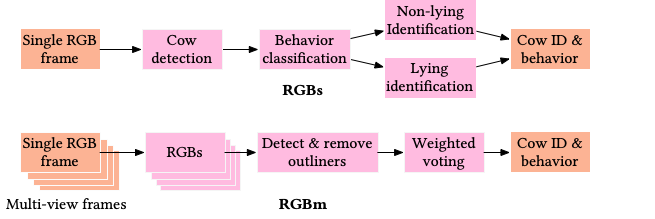

# Computer Vision-based Cow Monitoring
<p align="center">mmcows

<p align="center">
<br />

Data Preparation
------
1. If not done already, clone the repository [mmcows](https://github.com/neis-lab/mmcows.git)
    ```bash
    git clone https://github.com/neis-lab/mmcows.git
    ```
    Change the working directory of terminal to this repository:
    ```bash
    cd mmcows
    ```

2. Change the working directory to ```./benchmarks/1_behavior_cls/rgb```.
    ```bash
    cd ./benchmarks/1_behavior_cls/rgb
    ```
    
3. Install the required packages 
    ```bash
    pip3 install -r requirements.txt
    ```
    
4. Download visual_data.zip, cropped_bboxes.zip, and trained_models.zip from [this page](https://github.com/neis-lab/mmcows)

5. Extract visual_data.zip and trained_models.zip in the current working directory, i.e. ```mmcows/benchmarks/1_behavior_cls/rgb```.

6. Generate data directories required for training and testing by running the following command
    ```bash
    python data_preparation/vision_data_organization.py --data_splits_config_file ../../../configs/config_s2.json --image_dir ./visual_data/images/0725 --label_dir ./visual_data/labels/combined/0725 --output_dir ./organized_data
    ```

7. The labels contain cow IDs too. However, we would like to have an ID-agnostic cow detector. Therefore, we replace cow id with '0', where '0' represents a single object 'cow'
    ```bash
    python data_preparation/labels_for_detector.py --dataset_path ./organized_data
    ```

8. Unzip cropped_bboxes.zip inside './visual_data'<br>
    OR </br>
   [Optional] Crop bounding boxes from the original images using this script
   To generate bboxes for behavior classification
    ```bash
    python data_preparation/crop_data_prep/crop_bboxes_7b.py
    ```
    
    [Optional] To generate bboxes for standing and lying cow classification
    ```bash
    python data_preparation/crop_data_prep/crop_bboxes_16c.py
    ```
<br/>

9. **To skip training and use our trained models for testing and inference, go to [Overall Inference Pipeline](#overall-inference-pipeline). Else, follow the next steps.**
<br/>

10. Generate data directories required for behavior classifier training
    ```bash
    python data_preparation/classifier_data_preparation.py --data_splits_config_file ../../../configs/config_s2.json --image_dir ./visual_data/cropped_bboxes/behaviors --output_dir ./data_behavior_classification --experiment_type behavior
    ```

11. Generate data directories as required for standing cow classifier training    
    ```bash
    python data_preparation/classifier_data_preparation.py --data_splits_config_file ../../../configs/config_s2.json --image_dir ./visual_data/cropped_bboxes/standing --output_dir ./data_standing_cow_classification --experiment_type cow_id
    ```


12. Generate data directories as required for lying cow classifier training   
    ```bash
    python data_preparation/classifier_data_preparation.py --data_splits_config_file ../../../configs/config_s2.json --image_dir ./visual_data/cropped_bboxes/lying --output_dir ./data_lying_cow_classification --experiment_type cow_id
    ```

<br />
As shown in the figure at the top, we have the following stages of cow detection, behavior classification, and cow identification.
<br />

Stage 1: Cow Detection
------

1. Training:
    ```bash
    python cow_detection/train_yolov8.py --data_directory ../organized_data --epochs 20 --batch_size 16
    ```
    This will train the yolov8 model for all the folds in ./organized_data.


2. Testing:
    ```bash
    python cow_detection/test_yolov8.py --data_directory ../organized_data
    ```

<br />


Stage 2: Behavior Classification
------
1. Training:
    ```
    python behavior_classifier/train.py --normalization_values_file_path  norm_params.json --model_save_path ./behavior_classifier/saved_models --data_path ./data_behavior_classification --fold fold_1
    ```

2. Testing:
    ```
    python behavior_classifier/test.py --test_data_path ./data_behavior_classification/fold_1/test --normalization_values_file_path norm_params.json --fold fold_1 --model_path ./behavior_classifier/saved_models/best_model_fold_1.pt 
    ```
    The above command shows example usage for fold_1 test data split. Similarly, testing can be performed on fold_2, fold_3, fold_4, and fold_5.

<br />

Stage 3: Cow Identification
------

**Standing Cow Identification**

1. Training:
    ```
    python standing_cow_identifier/train.py --normalization_values_file_path norm_params.json --model_save_path ./standing_cow_identifier/saved_models --data_path ./data_standing_cow_classification --fold fold_1
    ```
    The above command shows example usage for fold_1 test data split. Similarly, testing can be performed on fold_2, fold_3, fold_4, and fold_5.

2. Testing
    ```
    python standing_cow_identifier/test.py --test_data_path ./data_standing_cow_classification/fold_1/test --normalization_values_file_path norm_params.json --fold fold_1 --model_path ./standing_cow_identifier/saved_models/best_model_fold_1.pt 
    ```
    The above command shows example usage for fold_1 test data split. Similarly, testing can be performed on fold_2, fold_3, fold_4, and fold_5.

<br />

**Lying Cow Identification**

1. Training:
    ```
    python lying_cow_identifier/train.py --normalization_values_file_path norm_params.json --model_save_path data_lying_cow_classification/saved_models --data_path ./data_lying_cow_classification --fold fold_1
    ```

2. Testing
    ```
    python lying_cow_identifier/test.py --test_data_path data_lying_cow_classification/fold_1/test --normalization_values_file_path norm_params.json --fold fold_1 --model_path ./data_lying_cow_classification/saved_models/best_model_fold_1.pt 
    ```
    The above command shows example usage for fold_1 test data split. Similarly, testing can be performed on fold_2, fold_3, fold_4, and fold_5 by replacing the corresponding command line arguments.

<br />

### Overall Inference Pipeline
------
1. Inference pipeline can be run either using the models trained in the previous steps or using the trained weights (trained_models.zip). If you trained the models, the folder trained_models should have been overwriten with the new weights. <br />
<!--Configuration is in ```./custom_ultralytics_yolov8/inference_config.json```.-->
Code adapted from https://github.com/ultralytics/ultralytics.
<!--2. Enter the configurations in ```./custom_ultralytics_yolov8/inference_config.json```
    
    ```fold``` : The fold to run inference pipeline on. e.g. "fold_1" <br />
    ```behav_model_path```: Path to behavior classification model trained weights file <br />
    ```standing_ID_model_path```: Path to non-lying cow classification model trained weights file <br />
    ```lying_ID_model_path```: Path to lying cow classification model trained weights file <br />
    ```cow_detection_model_path```: Path to yolov8 cow detection model trained weights file <br />-->
     
2. Run the following command:
    ```
    python custom_ultralytics_yolov8/pipeline.py --data_path ./organized_data/fold_1/test/images
    ```
    Each image will produce ```.txt``` files per test image with the same filename at the location mentioned in ```save_preds_directory```. Each row corresponds to a detected object, and has the following format:

    ```[cow_id x y w h behavior_id]```, where
    * x: The normalized x-coordinate of the center of the bounding box.
    * y: The normalized y-coordinate of the center of the bounding box.
    * w: The normalized width of the bounding box.
    * h: The normalized height of the bounding box.

    The above command shows example usage for fold_1 test data split. Similarly, testing can be performed on fold_2, fold_3, fold_4, and fold_5 by replacing the "fold" number in the command above and in all paths in ```./custom_ultralytics_yolov8/inference_config.json```:
   ```
    vi ./custom_ultralytics_yolov8/inference_config.json
    ```

<br />

Evaluation
------


1. In order to evaluate the performance of single view vision pipeline (i.e. RGBs), we compare the predicted labels with the ground truth using the following command:
    ```
    python ./eval/eval_srgb_s2.py 
    ```

    Running the above command prints the F-1 scores for all the behaviors for single-view vision pipeline (RGBs).

2. To evaluate the performance of multi-view vision pipeline (i.e. RGBm), use the following command:
    ```
    python ./eval/eval_mrgb_s2.py
    ```
    Running the above command prints the F-1 scores for all the behaviors for multi-view vision pipeline (RGBm).
